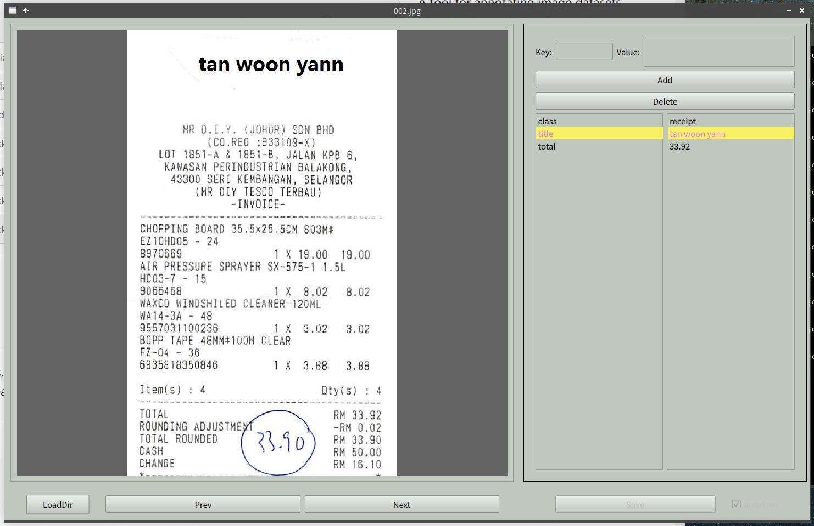

# label_it

A tool for annotating image datasets, allowing the creation of key-value pairs(json) for each image, with OCR assistanced (PaddleOCR based).

It suitable for creating datasets of Donut/LayoutLMv3(or other e2e models).

